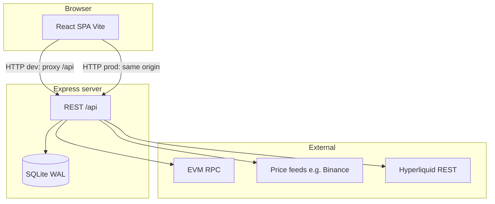

# Assetflow 设计文档

**工程根目录为 `assetflow/`。本文档（`design/DESIGN.md`）为项目唯一维护的设计说明**，涵盖目录边界、架构、前后端、API、数据与部署。若与代码不一致，以代码为准并回写本文。

同目录下的 `stitch.md`、`frontend-design-brief.md`、需求草稿等仅作参考，不替代本文。

---

## 1. 工程边界与目录地图

| 路径 | 说明 |
|------|------|
| 工程根（`assetflow/`） | **主应用**：前后端源码、`Makefile`、`Dockerfile`、`docker-compose.yml`、SQLite 数据目录 `server/data/`。日常开发与部署均以此为工作区。 |
| `design/` | **设计文档目录**：本文为规范；其余文件可选。 |
| `.claude/` | 编辑器/Agent 本地配置（若存在），不参与运行时。 |

### 高层数据流（Mermaid）



### 实现与运维注意

- **数据文件**：默认 SQLite 位于 `server/data/`（如 `assetflow.db`），备份与迁移需包含该目录。
- **本地生产静态资源**：Express 在 `NODE_ENV=production` 下从 `../../client` 相对 `server/dist` 提供前端；`make build` 会将 `dist/` 复制为 `client/`（见 [Makefile](../Makefile)）。仅运行 `npm run build` 时需自行执行 `rm -rf client && cp -R dist client`，详见 [README.md](../README.md)。
- **端口**：后端默认 `3001`；开发时 Vite 常见 `5173`，[vite.config.ts](../vite.config.ts) 将 `/api` 代理到后端。

---

## 2. 产品定位

Assetflow 是一个面向 DeFi 重度用户的个人加密货币投资组合管理仪表板。目标用户管理约 500 万 USDT 的组合，资产分布在多条链的 DeFi 协议（Uniswap、Aave、Morpho）和中心化交易所（CEX）中。核心功能是自动聚合所有链上持仓并计算每周/每月的 P&L（盈亏）。

**设计原则**

- 个人工具：无多用户、**本地部署优先**；简易鉴权见下文「访问控制」
- 数据准确优先：公允价值（LP 按本金计）vs 现金价值（计入无常损失）双口径
- 实时链上查询 + 本地持久化快照，数据不依赖第三方托管

### 访问控制（实现）

- 后端 **`POST /api/auth/login`**：请求体 `{ password }`，与环境变量 **`ADMIN_PASSWORD`**（默认 `Admin`）比对，成功返回 `{ success: true }`。
- 前端 **[`src/pages/Login.tsx`](../src/pages/Login.tsx)** 登录后把 `authMode`（`admin` | `guest`）写入 **`localStorage`**；**[`src/App.tsx`](../src/App.tsx)** 未登录跳转 `/login`。
- 管理类操作（录入 P&L、钱包等）由前端按 `authMode === 'admin'` 控制按钮展示；**API 层当前不逐路由校验 Session**（单用户本地场景可接受，若暴露公网需加固）。

---

## 3. 技术栈

### 前端

| 技术 | 版本 | 用途 |
|------|------|------|
| React | 19 | UI 框架 |
| React Router | 7 | 客户端路由 |
| Vite | 8 | 构建工具 |
| TailwindCSS | 4 | 样式系统 |
| Zustand | 5 | 全局状态管理 |
| Recharts | 3 | 图表组件 |
| TypeScript | 5.9 | 类型安全 |

### 后端

| 技术 | 版本 | 用途 |
|------|------|------|
| Node.js | 22 | 运行时 |
| Express | 5 | HTTP 框架 |
| better-sqlite3 | 12 | 本地数据库 |
| ethers.js | 6 | EVM 链交互 |
| ccxt | 4.5 | 价格数据（Binance） |
| node-cron | 4 | 定时任务 |
| TypeScript | 6 | 类型安全 |
| Vitest | 4 | 单元/集成测试 |

### 基础设施

- **数据库**：SQLite（WAL 模式），文件位于 `server/data/assetflow.db`
- **定时任务**（node-cron）：
  - UTC 00:00 — `runDailyPnlAutoAccumulate`（周度/月度 P&L 增量计算）
  - UTC+8 08:00 — `runAutoSnapshot`（每日仓位快照）
  - 两者均在启动时 catch-up 执行一次
- **容器化**：Docker 多阶段构建 + Docker Compose
- **构建**：Makefile 统一前后端构建/测试/部署命令

---

## 4. 系统架构

```
┌─────────────────────────────────────────────────────┐
│                    Browser (1440px+)                 │
│  ┌─────────────────────────────────────────────────┐ │
│  │  React App (Vite SPA)                           │ │
│  │  ├── Dashboard  (收益总览、资产分配文案、周/月度 P&L) │ │
│  │  ├── Positions  (持仓与价格、手动资产)             │ │
│  │  ├── WalletManagement（独立页：钱包列表）          │ │
│  │  ├── Settings   (结算参数等)                      │ │
│  │  └── AccountManagement（账户说明页）              │ │
│  └──────────────────┬──────────────────────────────┘ │
└─────────────────────│───────────────────────────────┘
                      │ HTTP /api/*
┌─────────────────────▼───────────────────────────────┐
│         Express Server (port 3001)                   │
│  ┌──────────────────────────────────────────────┐   │
│  │  REST API Routes                             │   │
│  │  /api/wallets   /api/positions               │   │
│  │  /api/pnl       /api/snapshots               │   │
│  │  /api/prices    /api/settings                │   │
│  └──────────┬────────────────────┬─────────────┘   │
│             │                    │                   │
│  ┌──────────▼──────────┐  ┌──────▼──────────────┐  │
│  │  SQLite Database     │  │  External Calls      │  │
│  │  (better-sqlite3)    │  │  ├── EVM RPC 节点    │  │
│  │  ├── wallets         │  │  │   (公共端点)       │  │
│  │  ├── snapshots       │  │  ├── Binance API     │  │
│  │  ├── pnl_records     │  │  │   (ccxt)          │  │
│  │  ├── revenue_overview│  │  └── Hyperliquid API │  │
│  │  ├── manual_assets   │  └─────────────────────┘  │
│  │  └── settings        │                            │
│  └─────────────────────┘                            │
└─────────────────────────────────────────────────────┘
```

### 开发模式

- 前端 Vite dev server（port 5173）将 `/api/*` 请求代理到后端 port 3001
- 前后端独立热重载，互不干扰

### 生产模式

- 后端同时提供 API 与前端静态资源（工程根目录下的 `client/`，由构建步骤从 `dist/` 生成）
- 单进程单端口；Docker 容器内运行见 [Dockerfile](../Dockerfile)

---

## 5. 前端设计

### 页面结构

```
App
├── /login（未登录）
└── Layout（登录后：固定侧边栏 + 顶栏）
    ├── / → Dashboard（收益总览、资产分配摘要、周/月度 P&L 表与图）
    ├── /positions → Positions（分组卡片、刷新时间、手动资产）
    ├── /wallets → WalletManagement（钱包 CRUD、浏览器链接）
    ├── /settings → Settings（通用设置项）
    └── /account → AccountManagement
```

### 状态管理（Zustand Store）

所有 API 数据集中在单一 store `useStore.ts`：

```typescript
interface AppStore {
  // 数据
  positions: TokenPosition[];
  weeklyPnl: PnlRecord[];
  monthlyPnl: PnlRecord[];
  revenueOverview: RevenueOverview | null;
  manualAssets: ManualAsset[];
  wallets: Wallet[];
  settings: AppSettings;

  // 状态
  loading: boolean;
  error: string | null;

  // Actions
  fetchPositions(): Promise<void>;
  fetchWeeklyPnl(): Promise<void>;
  fetchMonthlyPnl(): Promise<void>;
  fetchRevenueOverview(): Promise<void>;
  fetchManualAssets(): Promise<void>;
  fetchWallets(): Promise<void>;
  fetchSettings(): Promise<void>;
}
```

### 核心数据类型

```typescript
// 子持仓（最小粒度）
interface SubPosition {
  id: string;
  label: string;                   // 例: "主钱包-ETH/USDC-仓位"
  source: 'wallet' | 'lp' | 'lp_fees' | 'lending' | 'hlp' | 'cex_manual';
  // lp_fees: Uniswap V3 未领取手续费（通过 collect.staticCall 读取）
  // hlp: Hyperliquid HLP Vault 权益
  protocol?: string;               // Uniswap V3 / Aave V3 / Morpho...
  chain?: string;                  // ethereum / arbitrum / base...
  amount: number;
  usdValue: number;
}

// 按基础资产分组
interface TokenPosition {
  baseToken: 'STABLE' | 'ETH' | 'BTC' | 'BNB' | string;
  subPositions: SubPosition[];
  totalAmount: number;
  totalUsdValue: number;
}

// P&L 记录（周度或月度）— 与 API `formatPnlRecord` 对齐
interface PnlRecord {
  id: string;
  period: 'weekly' | 'monthly';
  startDate: string;
  endDate: string;
  startingCapital: number;
  endingCapital: number;
  pnl: number;
  returnRate: number;
  days: number;
  annualizedReturn: number;
  isAdjusted: boolean;
  status?: 'in_progress' | 'settled' | 'locked';
  autoAccumulate?: boolean;
  editable?: boolean;
  incomeUniswap?: number;
  incomeMorpho?: number;
  incomeHlp?: number;
  incomeTotal?: number;
  lastAutoUpdateAt?: string | null;
  /** 仅月度：已结算周累计入袋部分（周结算时写入，见 §9） */
  basePnl?: number;
  /** 周初基准值（创建时写入，周内不变；可通过 PUT 手动修正） */
  lastUniswapValue?: number;
  lastMorphoValue?: number;
  lastHlpValue?: number;
}
```

---

## 6. 后端设计

### 目录结构

```
server/src/
├── index.ts          # 入口：启动 HTTP 服务器 + cron 定时任务
├── app.ts            # Express 应用配置（路由注册 + 生产静态服务）
├── db/
│   ├── index.ts      # SQLite 连接单例，WAL 模式
│   └── schema.sql    # 建表 DDL + 默认数据
├── config/
│   ├── chains.ts     # RPC 端点、链 ID、代币定义、分组逻辑
│   └── defi.ts       # DeFi 协议合约地址（Uniswap/Aave/Morpho）
├── routes/
│   ├── auth.ts       # POST /api/auth/login（ADMIN_PASSWORD）
│   ├── wallets.ts    # 钱包 CRUD
│   ├── positions.ts  # 持仓聚合（核心路由）
│   ├── snapshots.ts  # 快照存取 + 每日自动快照（runAutoSnapshot）
│   ├── pnl.ts        # P&L 计算与管理
│   ├── prices.ts     # 价格查询
│   └── settings.ts   # 设置 CRUD
├── defi/
│   ├── evmBalance.ts      # EVM 原生 + ERC20 余额
│   ├── uniswapV3.ts       # Uniswap V3 LP 持仓 + 手续费
│   ├── aaveV3.ts          # Aave V3 存款/借款
│   ├── morphoBlue.ts      # Morpho Blue 市场持仓
│   ├── morphoVault.ts     # Morpho Vault (ERC-4626) 持仓
│   └── hyperliquidHlp.ts  # Hyperliquid HLP Vault（REST API）
└── utils/
    └── price.ts      # Binance 价格获取 + 稳定币处理
```

### API 端点总览

与 **[`server/src/app.ts`](../server/src/app.ts)** 挂载一致（节选；健康检查在 `app` 根级）。

| 方法 | 路径 | 描述 |
|------|------|------|
| GET | `/api/health` | 健康检查 |
| POST | `/api/auth/login` | 管理员密码登录（`{ password }`） |
| GET | `/api/wallets` | 获取所有钱包 |
| POST | `/api/wallets` | 添加钱包 |
| DELETE | `/api/wallets/:id` | 删除钱包 |
| POST | `/api/positions/fetch` | 聚合所有持仓（链上 / OKX + 手动） |
| GET | `/api/positions/manual` | 获取手动资产 |
| POST | `/api/positions/manual` | 添加/更新手动资产 |
| DELETE | `/api/positions/manual/:id` | 删除手动资产 |
| POST | `/api/snapshots` | 创建快照 |
| GET | `/api/snapshots` | 查询快照（支持日期过滤） |
| GET | `/api/pnl/weekly` | 周度 P&L 记录 |
| GET | `/api/pnl/monthly` | 月度 P&L 记录 |
| POST | `/api/pnl/weekly` | 创建周度记录（进行中 / 或历史补录）；结算上一条进行中周并 `bakeWeeklyPnlIntoMonthly` |
| POST | `/api/pnl/monthly` | 创建月度记录（`auto: true` 为进行中） |
| POST | `/api/pnl/calculate` | 从最新两个快照计算 P&L |
| PUT | `/api/pnl/:id` | 手动修正 P&L + 基准值（`lastUniswapValue/lastMorphoValue/lastHlpValue`）；**进行中月度**保存后仍为 `in_progress`；已锁定月仍为 `locked` |
| DELETE | `/api/pnl/:id` | 删除一条 P&L 记录 |
| GET | `/api/pnl/revenue` | 获取收益总览 |
| PUT | `/api/pnl/revenue` | 更新收益总览 |
| GET | `/api/prices` | 查询代币价格（`?symbols=ETH,BTC`） |
| GET | `/api/settings` | 获取所有设置 |
| PUT | `/api/settings` | 更新设置 |

---

## 7. 持仓聚合流程（核心业务逻辑）

`POST /api/positions/fetch` 是系统最核心的端点，执行以下步骤：

```
1. 读取 DB 中所有已配置钱包

2. 按钱包类型走不同路径：

   【EVM 直查路径（非 OKX）】
   并行获取每个钱包的链上数据：
   ├── EVM 余额（原生代币 + ERC20）
   ├── Uniswap V3 LP 持仓（本金量） + 未收取手续费（collect.staticCall）
   ├── Aave V3 存款/借款余额
   ├── Morpho Blue 市场持仓
   ├── Morpho Vault (ERC-4626) 份额
   └── Hyperliquid HLP Vault 权益（REST API）

   【OKX Web3 路径】
   通过 OKX API 批量获取代币余额（含 LP 本金），再补充：
   ├── Hyperliquid HLP：Hyperliquid REST API（OKX 不含 HLP）
   └── Uniswap V3 手续费：直接调用 EVM RPC collect.staticCall
       （OKX API 将手续费混入本金，无法拆分，需单独读链上）

3. 从 settings 表读取 Morpho 市场 ID 和 Vault 地址

4. 汇总所有代币符号 → 一次性调用 Binance 获取价格
   ├── 稳定币直接返回 $1，不发请求
   ├── 同时写入分组级价格 key（如 cbBTC→BTC，stETH→ETH）
   └── ETH/BTC/BNB 基础价格兜底：若 Binance 未返回则重试

5. 按基础资产分组：
   STABLE（USDT/USDC/DAI...）/ ETH（ETH/WETH/stETH/cbETH...）
   BTC（BTC/WBTC/cbBTC/tBTC...）/ BNB（BNB/WBNB）/ 其他

6. 读取手动资产（CEX 余额等），合并到对应分组；**`usdValue`**：`STABLE` 按 $1，`ETH`/`BTC`/`BNB` 分组键使用当前 `prices` 乘以数量（与链上子仓加总口径一致）

7. 返回 TokenPosition[] + prices + timestamp
```

### 单链协议查询方式

| 协议 | 查询方式 | 说明 |
|------|---------|------|
| EVM Balance | `provider.getBalance()` + `contract.balanceOf()` | 原生代币 + 硬编码 ERC20 列表 |
| Uniswap V3 本金 | NFT Position Manager + Factory + Pool slot0 | 用 V3 数学公式计算持仓量 |
| Uniswap V3 手续费 | `nft.collect.staticCall({amount0Max, amount1Max})` | 读取 pool 累积的全量未领手续费（含 pool 未同步到 tokensOwed 的部分） |
| Aave V3 | UI Pool Data Provider | 含缩放后的 aToken 换算 |
| Morpho Blue | `morpho.position()` + `morpho.market()` | shares → assets 换算 |
| Morpho Vault | ERC-4626 `balanceOf` + `convertToAssets` | 份额换算为底层资产 |
| Hyperliquid | REST POST `api.hyperliquid.xyz/info` | 获取 HLP Vault 权益 |
| OKX Web3 | OKX Web3 API 批量余额 | 支持多链汇总，LP 含本金+手续费混合 |

---

## 8. Uniswap V3 数学模型

Uniswap V3 LP 的持仓量计算基于流动性、Tick 范围和当前价格：

```typescript
// Tick → sqrtPrice（精度 Q96）
tickToSqrtPriceX96(tick) = sqrt(1.0001^tick) * 2^96

// 根据价格区间计算持仓量
if (currentPrice <= lowerBound):
    amount0 = liquidity * Q96 * (sqrtB - sqrtA) / (sqrtA * sqrtB)  // 全为 token0
    amount1 = 0

if (currentPrice >= upperBound):
    amount0 = 0
    amount1 = liquidity * (sqrtB - sqrtA) / Q96                    // 全为 token1

if (lowerBound < currentPrice < upperBound):
    amount0 = liquidity * Q96 * (sqrtB - sqrtPrice) / (sqrtPrice * sqrtB)
    amount1 = liquidity * (sqrtPrice - sqrtA) / Q96                // 双 token
```

这是系统中最精密的纯逻辑，已有独立单元测试覆盖。

---

## 9. P&L 计算模型

### 双口径估值

| 口径 | 含义 | 计算方式 |
|------|------|---------|
| **公允价值（Fair Value）** | 以投入本金估算 LP 价值 | LP 以原始投入金额计算，忽略无常损失 |
| **现金价值（Cash Value）** | 实际可变现金额 | LP 按当前市场价格计算，反映无常损失 |

公允价值不含无常损失；现金价值含无常损失及已实现损益。

### 周度 P&L：仅追踪 LP 手续费 + HLP + Morpho 增量

**设计原则**：周度收益只反映"收入增量"（协议手续费、HLP 权益、Morpho 利息），不含本金涨跌和无常损失。

**周开始基准（`last_*_value`）**：
- 每次创建新周记录时，先成功 fetch 当前持仓聚合数据，将 uniswap/morpho/hlp 三项当前值写入 `last_*_value` 作为本周基准。
- 若 fetch 失败则拒绝创建（避免零基准导致下一次计算出虚假巨额收益）。

**每日自动快照（`runAutoSnapshot`）**：
每天北京时间 08:00（UTC+8）自动调用 `fetchPositionsAggregate()`，将仓位聚合数据写入 `snapshots` 表（type=`auto`）。按 UTC+8 日期幂等去重，同一天只写一次。启动时也 catch-up 执行一次。连续两天快照的 `total_fair_value` 差值即当天总收益。

**每日 PnL 增量计算（`runDailyPnlAutoAccumulate`）**：
```
weekUniswap = max(0, income.uniswap - record.last_uniswap_value)
weekMorpho  = max(0, income.morpho  - record.last_morpho_value)
weekHlp     = max(0, income.hlp     - record.last_hlp_value)
nextPnl = weekUniswap + weekMorpho + weekHlp
```
- **SET 不累加**：每次覆盖写入（从周初基准重新算到今天），避免误差累积。
- **`last_*_value` 不更新**：始终保持周初快照，仅在新建记录时写入。
- **拉取失败则不更新**：若 `fetchPositionsAggregate` 失败（无法得到 `incomeBreakdown`），**当次不写入任何进行中周度行**，避免把 P&L 静默覆盖成错误值。
- LP 手续费设计：若当前手续费低于基准（如已手动提取），则当周该部分收益记为 0（max(0,...)），下次结算时自然从 0 重新开始累积。

**周度结算（settlement）**：
- 将本周 pnl 烘入月度 `base_pnl`（`bakeWeeklyPnlIntoMonthly()`）
- 将本周状态从 `in_progress` → `settled`
- 创建下一周新记录，重新 fetch 当前基准

### 月度 P&L：base_pnl + 在途周度

月度 pnl 由两部分构成：
```
monthly.pnl = base_pnl + current_in_progress_weekly.pnl
```
- `base_pnl`：所有已结算周的 pnl 之和（每次周结算时累加写入，之后不变）
- `current_in_progress_weekly.pnl`：当前在途周的实时 pnl（每日快照时只读取，不修改 base_pnl）

进行中月度的 **`end_date` / 合计 pnl** 随「当前在途周 + 日更结果」通过 **`syncMonthlyInProgressFromWeekly()`** 同步；新建周度、编辑周度结束日、或日更成功后均会触发对齐。已锁定月不变。

### 收益来源分类（`buildIncomeBreakdown`）

| 来源 | source 标识 | 说明 |
|------|------------|------|
| Uniswap LP 手续费 | `lp_fees` | collect.staticCall 读取的未领手续费，U 本位计算 |
| Morpho 利息 | 所有 morpho 协议持仓合计 | 存款利息（Morpho Blue + Vault） |
| Hyperliquid HLP | `hlp` | HLP Vault 权益变动 |

---

## 10. 数据库设计

**基线 DDL** 见 **[`server/src/db/schema.sql`](../server/src/db/schema.sql)**（新建库时执行）。下列 **P&L 扩展列** 在历史数据库上由 **[`server/src/routes/pnl.ts`](../server/src/routes/pnl.ts)** 内 `ensurePnlRecordColumns()` 以 `ALTER TABLE` 幂等补全（与 `schema.sql` 新装实例并存）：

- `status`, `auto_accumulate`, `editable`, `income_*`, `last_*_value`, `last_auto_update_at`, **`base_pnl`**

```sql
-- 钱包（多链地址）
wallets (id, label, address, chains_json)

-- 时间序列快照（持仓 + 价格 JSON）
snapshots (id, timestamp, type, total_fair_value, total_cash_value, positions_json, prices_json)
INDEX ON (timestamp)

-- P&L 记录（周度/月度）
pnl_records (
  id, period, start_date, end_date, starting_capital, ending_capital,
  pnl, return_rate, days, annualized_return, is_adjusted,
  -- 收入拆分（展示/调试）
  income_uniswap, income_morpho, income_hlp, income_total,
  -- 周初基准（创建周时写入，周内不变）
  last_uniswap_value, last_morpho_value, last_hlp_value,
  last_auto_update_at,
  -- 月度：已结算周入袋累计（周结算 bake）
  base_pnl,
  -- 状态（CHECK 以 schema.sql 为准）
  status,            -- 'in_progress' | 'settled' | 'locked'（月度已锁定用 locked）
  auto_accumulate, editable
)
INDEX ON (period, start_date)

-- 收益总览（单行，手动维护）
revenue_overview (id, period_label, start_date, initial_investment, fair_value,
                  cash_value, profit, return_rate, running_days, annualized_return)

-- 手动资产（CEX 余额等）
manual_assets (id, label, base_token, amount, source, platform, updated_at)

-- 配置项（KV 表）
settings (key, value)
-- 内置 key：settlement_day, auto_snapshot, base_currency
-- 可扩展：morpho_market_ids, morpho_vault_addresses
```

---

## 11. 测试策略

### 分层测试

| 层次 | 覆盖范围 | 工具 |
|------|---------|------|
| 纯逻辑单元测试 | Uniswap V3 数学、Token 分组逻辑 | Vitest |
| DB 集成测试 | CRUD 路由（内存 SQLite） | Vitest + supertest |
| DeFi 集成测试 | 链上查询（真实 RPC） | `test-defi.ts` 手动脚本 |

### 测试文件

```
server/src/
├── defi/uniswapV3.test.ts
├── config/chains.test.ts
├── routes/wallets.test.ts
├── routes/pnl.test.ts
├── routes/settings.test.ts
└── …
```

在工程根目录执行 **`make test`**（或 `cd server && npm test`）以运行当前全部 Vitest 用例；**具体个数随代码变动，不以固定数字写死。**

### DB Mock 策略

路由测试通过 `vi.mock('../db/index.js')` 替换生产数据库为内存实例：

```typescript
const testDb = createTestDb();          // 内存 SQLite + 完整 schema
vi.mock('../db/index.js', () => ({ default: testDb }));
```

---

## 12. 支持的链和协议

### 区块链网络

| 链 | 链 ID | 支持协议 |
|---|------|---------|
| Ethereum | 1 | EVM Balance, Uniswap V3, Aave V3, Morpho |
| Arbitrum | 42161 | EVM Balance, Uniswap V3, Aave V3 |
| Optimism | 10 | EVM Balance, Uniswap V3, Aave V3 |
| Base | 8453 | EVM Balance, Uniswap V3, Aave V3, Morpho |
| Polygon | 137 | EVM Balance, Uniswap V3, Aave V3 |
| BSC | 56 | EVM Balance |
| Avalanche | 43114 | EVM Balance, Aave V3 |

RPC 端点使用公共节点（llamarpc、arbitrum.io 等），无需配置 API Key。

**RPC 可靠性（FallbackProvider）**：Ethereum 支持通过环境变量 `ETH_RPC_FALLBACK` 配置备用节点（如 Alchemy），当公共节点失败时自动切换：
```
createProvider('ethereum') →
  FallbackProvider([llamarpc (priority 1), alchemy (priority 2)], stallTimeout=2000ms)
```
其他链暂时只有公共节点。公共节点有速率限制，Uniswap V3 的 `tokenOfOwnerByIndex` 循环调用之间加 200ms 间隔。

### DeFi 协议合约地址

| 协议 | 合约类型 | 地址 |
|------|---------|------|
| Uniswap V3 | Position Manager (ETH/ARB/OP/POLY) | `0xC36442b4...` |
| Uniswap V3 | Position Manager (Base) | `0x03a520b3...` |
| Uniswap V3 | Factory (ETH/ARB/OP/POLY) | `0x1F98431c...` |
| Morpho Blue | Core (ETH + Base) | `0xBBBBBbbB...` |

---

## 13. 钱包地址浏览器链接

钱包管理页的地址列渲染为可点击链接，规则如下：

| 地址类型 | 链接目标 |
|---------|---------|
| 包含 `bitcoin` 链 | `https://mempool.space/address/{address}` |
| 包含 `solana` 链 | `https://jup.ag/portfolio/{address}` |
| `0x` 开头 + 42 字符（EVM） | `https://debank.com/profile/{address}` |
| 其他 | 纯文本显示 |

逻辑位于 `src/pages/WalletManagement.tsx` 的 `getAddressUrl()` 函数。

---

## 14. 部署架构

### 开发模式

```
Terminal 1: cd server && npm run dev   # port 3001
Terminal 2: npm run dev                # port 5173, proxies /api to 3001
```

### 生产模式（本地）

```bash
make build   # 构建前后端，并生成 client/
make start   # NODE_ENV=production，单进程服务 API + 静态文件
```

### Docker 模式

```
┌──────────────────────────────────────────┐
│  Docker Container                         │
│  ├── Node.js process (port 3001)          │
│  │   ├── Express API  (/api/*)            │
│  │   └── Static files (frontend client/)  │
│  └── Volume: /app/server/data (SQLite)    │
└──────────────────────────────────────────┘
       ↑ port 3001
  Host Machine
```

多阶段 Dockerfile：

1. **Stage 1**：Node.js + npm → 构建前端 (`dist/`)
2. **Stage 2**：Node.js + build tools → 编译后端 TypeScript
3. **Stage 3**：精简运行时，仅含编译产物和生产依赖

SQLite 数据文件通过 Docker volume 持久化，容器重建不丢数据。

---

## 相关链接

- [README.md](../README.md) — 安装、开发、生产与 Docker 运行步骤
